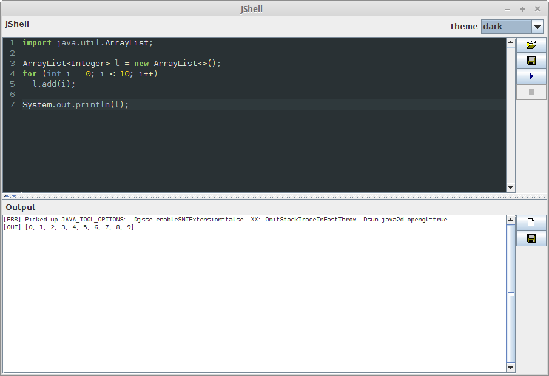

# jshell-scripting

Java widget for scripting with [jshell](https://docs.oracle.com/javase/9/jshell/). 
Requires Java 9 or later, as it relies on the `jshell` executable in Java's `bin` 
directory.

The widget comes in form of a panel with two parts, the scripting part for your code 
(including syntax highlighting thanks to [RSyntaxTextArea](http://bobbylight.github.io/RSyntaxTextArea/))
and the output part, which will receive any output generated by `jshell`.

With this widget you can write Java code without having to compile it, `jshell`
takes care of that.


## Usage

### Java GUI

You only have to place the `JShellPanel` in a frame or dialog and you
can start scripting (see example [GUI.java](src/main/java/com/github/fracpete/jshell/examples/GUI.java)).

```java
import javax.swing.JFrame;
import com.github.fracpete.jshell.JShellPanel;
...
JShellPanel panel = new JShellPanel();
JFrame frame = new JFrame("JShell");
frame.getContentPane().setLayout(new BorderLayout());
frame.getContentPane().add(panel, BorderLayout.CENTER);
frame.setSize(1200, 900);
frame.setDefaultCloseOperation(BaseFrame.EXIT_ON_CLOSE);
frame.setLocationRelativeTo(null);
frame.setVisible(true);
```

It is also possible to listen to events in the widget, by supplying a
`com.github.fracpete.jshell.event.JShellPanelListener` object. For listening to 
execution events, supply a `com.github.fracpete.jshell.event.JShellExecListener` 
object. The following code simply outputs the event types to stdout (see 
example [GUIEvents.java](src/main/java/com/github/fracpete/jshell/examples/GUIEvents.java)):

```java
import com.github.fracpete.jshell.event.JShellExecEvent;
import com.github.fracpete.jshell.event.JShellExecListener;
import com.github.fracpete.jshell.event.JShellPanelEvent;
import com.github.fracpete.jshell.event.JShellPanelListener;
import com.github.fracpete.jshell.JShellPanel;
...
JShellPanel panel = new JShellPanel();
panel.addJShellExecListener((JShellExecEvent e) -> System.out.println("exec: " + e.getType()));
panel.addJShellPanelListener((JShellPanelEvent e) -> System.out.println("panel: " + e.getType()));
```

There are several themes available:
* dark
* default
* default-alt
* eclipse
* idea
* monokai
* vs

Which you can get/set via the following methods of the `JShellPanel` class:
* `getCurrentTheme()`
* `setCurrentTheme(String)`

### Java backend

You can also execute code in the background using the `JShellExec` class
(see example [Exec.java](src/main/java/com/github/fracpete/jshell/examples/Exec.java)):

```java
import com.github.fracpete.jshell.JShellExec;
...
String code = "for (int i = 0; i < 10; i++) System.out.println(i)";
JShellExec exec = new JShellExec();
exec.runScript(code);
```

If you want to react to error messages, simply add a `com.github.fracpete.jshell.event.JShellErrorListener` listener:

```java
import com.github.fracpete.jshell.JShellExec;
import com.github.fracpete.jshell.event.JShellErrorListener;
...
String code = "for (int i = 0; i < 10; i++) System.out.println(j)";
JShellExec exec = new JShellExec();
exec.addJShellErrorListener(new JShellErrorListener() {
  public void jshellErrorOccurred(JShellErrorEvent e) {
    System.err.println(e.getMessage());
    if (e.hasException())
      e.getException().printStackTrace();
  }
});
exec.runScript(code);
```

Just like with `JShellPanel`, you can add listeners for events to the execution
(e.g., that the execution has finished) by supplying a 
`com.github.fracpete.jshell.event.JShellExecListener` instance. The following 
code just outputs the event types to stdout (see example [ExecEvents.java](src/main/java/com/github/fracpete/jshell/examples/ExecEvents.java)): 

```java
import com.github.fracpete.jshell.JShellExec;
...
String code = "for (int i = 0; i < 10; i++) System.out.println(i)";
JShellExec exec = new JShellExec();
exec.addJShellExecListener((JShellExecEvent e) -> System.out.println("exec: " + e.getType()));
exec.runScript(code);
```

### Additional flags

`JShellPanel` and `JShellExec` both support JShell's additional flags: 

* `-J` - runtime flags, used by JShell itself, e.g., `-verbose`
* `-R` - remote runtime flags, the JVM that executes the code, e.g., `-javaagent:some.jar`
* `-C` - compiler flags

In case of `JShellPanel`, you can supply/access these flags via the following methods:
* `setRuntimeFlags(List<String>)/getRuntimeFlags()`
* `setRemoteRuntimeFlags(List<String>)/getRemoteRuntimeFlags()`
* `setCompilerFlags(List<String>)/getCompilerFlags()`

In case of `JShellExec`, these flags have to be supplied to the `runScript` method.


### Command-line

You don't have to use the widget in your own code, you can simply go ahead
and do some scripting. Here is what you need to do:

* download a release zip file and unzip it
* place any additional jars that you want to use for coding in the `lib` directory
* start up the user interface with the appropriate script:

    * Linux/OSX: `bin/jshell.sh`
    * Windows: `bin\jshell.bat`

* start scripting


## Releases

* [0.1.1](https://github.com/fracpete/jshell-scripting/releases/download/jshell-scripting-0.1.1/jshell-scripting-0.1.1-bin.zip)
* [0.1.0](https://github.com/fracpete/jshell-scripting/releases/download/jshell-scripting-0.1.0/jshell-scripting-0.1.0-bin.zip)
* [0.0.4](https://github.com/fracpete/jshell-scripting/releases/download/jshell-scripting-0.0.4/jshell-scripting-0.0.4-bin.zip)
* [0.0.3](https://github.com/fracpete/jshell-scripting/releases/download/jshell-scripting-0.0.3/jshell-scripting-0.0.3-bin.zip)
* [0.0.2](https://github.com/fracpete/jshell-scripting/releases/download/jshell-scripting-0.0.2/jshell-scripting-0.0.2-bin.zip)
* [0.0.1](https://github.com/fracpete/jshell-scripting/releases/download/jshell-scripting-0.0.1/jshell-scripting-0.0.1-bin.zip)


## Maven

Add the following dependency to your `pom.xml`:

```xml
    <dependency>
      <groupId>com.github.fracpete</groupId>
      <artifactId>jshell-scripting</artifactId>
      <version>0.1.1</version>
    </dependency>
```

## Screenshots

Default theme:


Dark theme:


