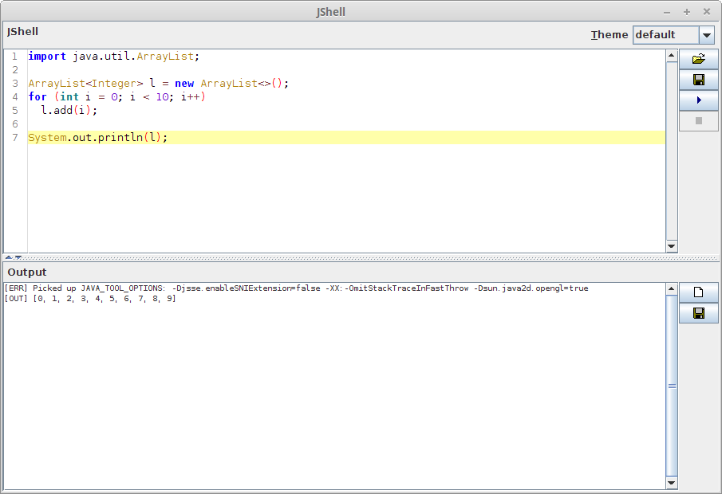

# jshell-scripting

Java widget for scripting with [jshell](https://docs.oracle.com/javase/9/jshell/). 
Requires Java 9 or later, as it relies on the `jshell` executable in Java's `bin` 
directory.

The widget comes in form of a panel with two parts, the scripting part for your code 
(including syntax highlighting thanks to [RSyntaxTextArea](http://bobbylight.github.io/RSyntaxTextArea/))
and the output part, which will receive any output generated by `jshell`.

With this widget you can write Java code without having to compile it, `jshell`
takes care of that.


## Usage

### Java

You only have to place the `JShellPanel` in a frame or dialog and you
can start scripting.

```java
import javax.swing.JFrame;
import com.github.fracpete.jshell.JShellPanel;
...
JShellPanel panel = new JShellPanel();
JFrame frame = new JFrame("JShell");
frame.getContentPane().setLayout(new BorderLayout());
frame.getContentPane().add(panel, BorderLayout.CENTER);
frame.setSize(1200, 900);
frame.setDefaultCloseOperation(BaseFrame.EXIT_ON_CLOSE);
frame.setLocationRelativeTo(null);
frame.setVisible(true);
```

It is also possible to listen to events in the widget, by supplying a
`com.github.fracpete.jshell.event.JShellListener` object. The following code
simply outputs the event type to stdout:

```java
import com.github.fracpete.jshell.event.JShellEvent;
import com.github.fracpete.jshell.event.JShellListener;
import com.github.fracpete.jshell.JShellPanel;
...
JShellPanel panel = new JShellPanel();
panel.addJShellListener((JShellEvent e) -> System.out.println(e.getType()));
```

## Command-line

You don't have to use the widget in your own code, you can simply go ahead
and do some scripting. Here is what you need to do:

* download a release zip file and unzip it
* place any additional jars that you want to use for coding in the `lib` directory
* start up the user interface with the appropriate script:

    * Linux/OSX: `bin/jshell.sh`
    * Windows: `bin\jshell.bat`

* start scripting


## Releases

* [0.0.3](https://github.com/fracpete/jshell-scripting/releases/download/jshell-scripting-0.0.3/jshell-scripting-0.0.3-bin.zip)
* [0.0.2](https://github.com/fracpete/jshell-scripting/releases/download/jshell-scripting-0.0.2/jshell-scripting-0.0.2-bin.zip)
* [0.0.1](https://github.com/fracpete/jshell-scripting/releases/download/jshell-scripting-0.0.1/jshell-scripting-0.0.1-bin.zip)


## Maven

Add the following dependency to your `pom.xml`:

```xml
    <dependency>
      <groupId>com.github.fracpete</groupId>
      <artifactId>jshell-scripting</artifactId>
      <version>0.0.3</version>
    </dependency>
```

## Screenshot


